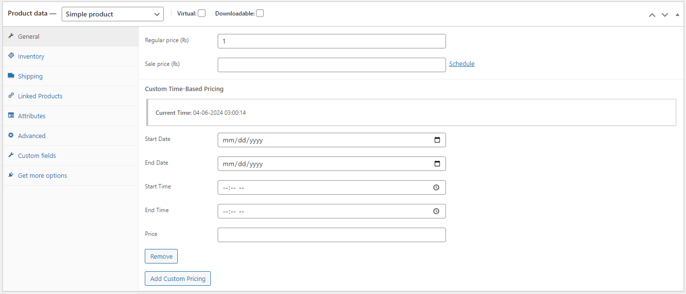

# Time-Based Product Pricing

Contributors: Roshan Chapagain

Tags: business, directory, WooCommerce, pricing, time-based pricing

Requires at least: 4.3

Requires PHP: 5.6

Tested up to: 6.5.3

Stable tag: 1.0.0

License: GPLv2 or later

License URI: [http://www.gnu.org/licenses/gpl-2.0.html](http://www.gnu.org/licenses/gpl-2.0.html)

Set different prices for WooCommerce products based on time periods.

## Description

With this plugin, you can set custom prices for your WooCommerce products. This is best if you want to create time-based sales in your store.

### Features
- Easy to Use
- Multi-time period selection

## Installation

This section describes how to install the plugin and get it working.

1. Upload `time-based-product-pricing` to the `/wp-content/plugins/` directory
2. Activate the plugin through the 'Plugins' menu in WordPress

## Frequently Asked Questions

### Is this a cool plugin?
Yes

## Screenshots

1. Desktop view

## Changelog

### v1.0.0
* Initial release

## Upgrade Notice

### v1.0.0
* Initial release
